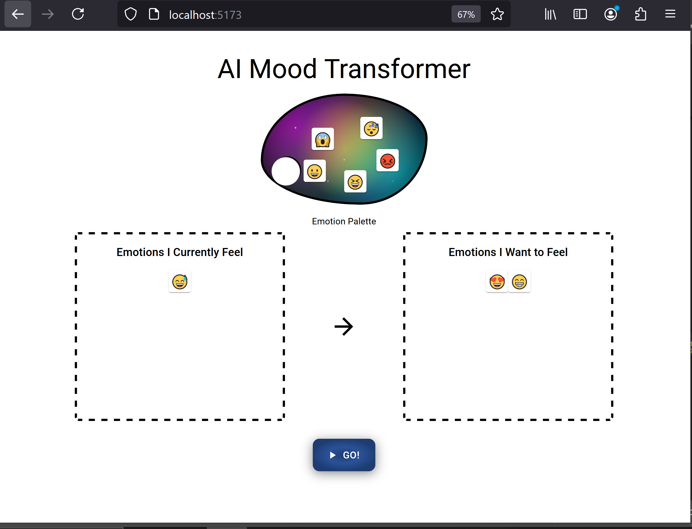
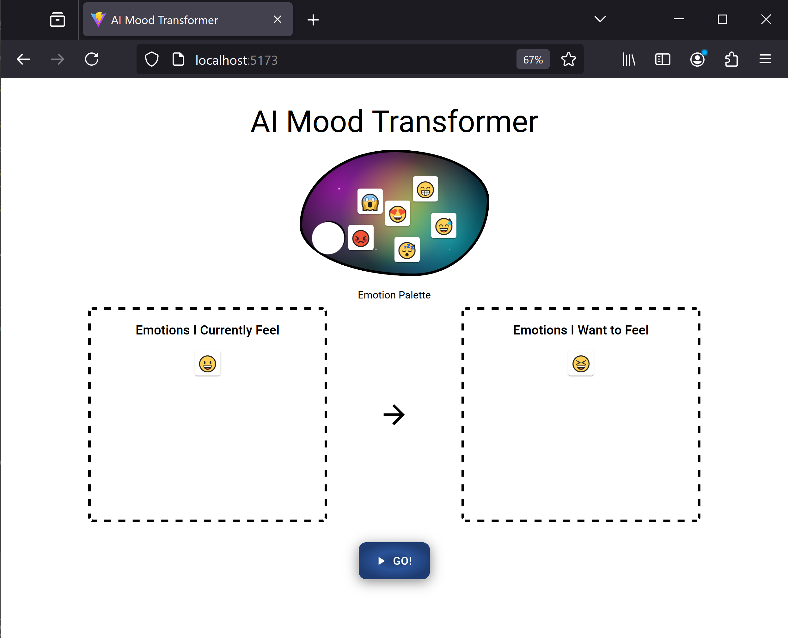

# AI Mood Transformer

Just a fun app to experiment with powerful AI Images that evoke an emotional response. This app lets users drag and drop emojis. Users describe their current emotion and their desired emotion via emojis. An AI Generated Image is created to help transform the user's emotions to desired state.

## Tech Stack
Vite, React, MaterialUI, OpenAI NodeJS Library, DAL-E 3 API

## Screenshots

